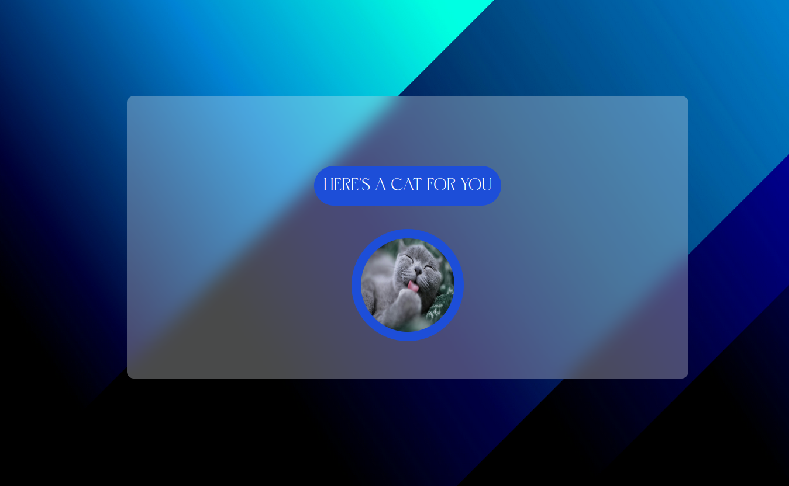
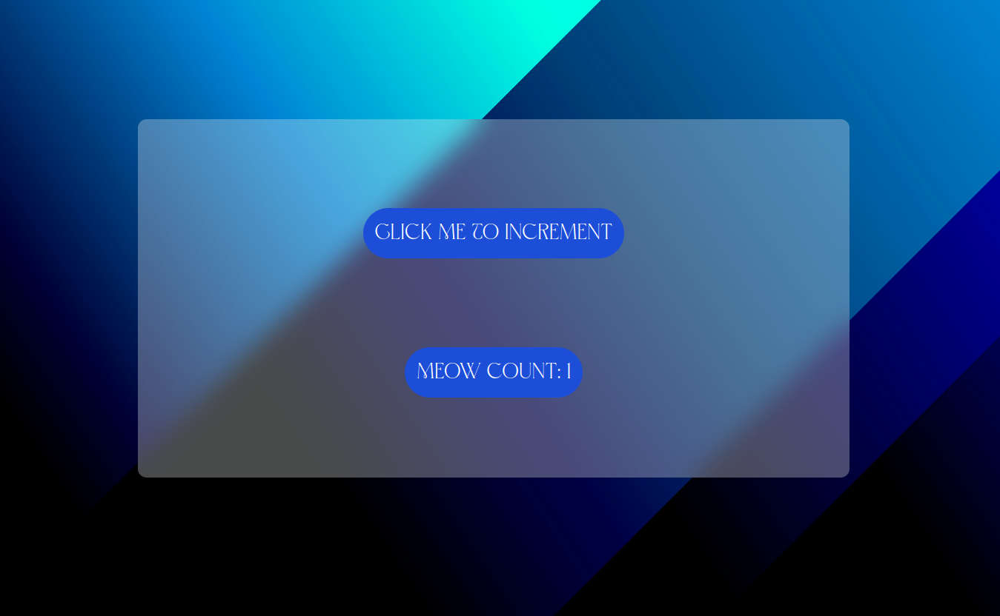
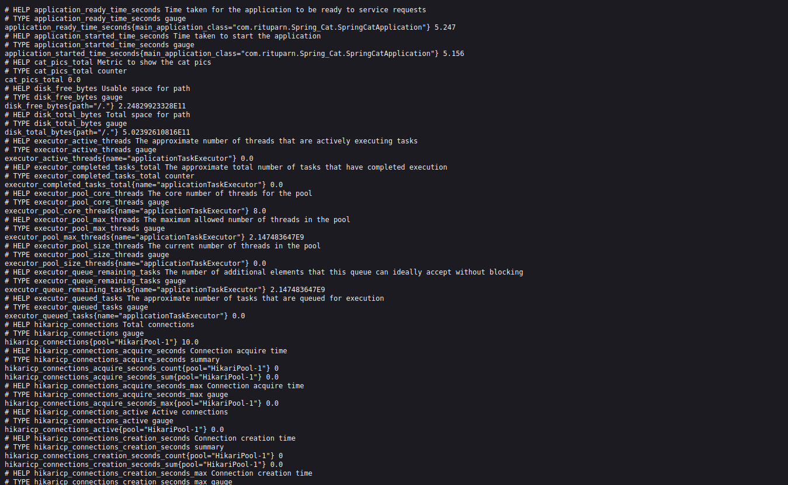

<h1 align=cente">
 🐱  Spring Cat 🐱 
</h1> 




---

<h2 align=center>
 Технологический стек
</h2> 

<div align=center >


</div>

---

## Введение

Добро пожаловать в сервис **Spring Cat**! Это приложение построено с использованием Spring Boot и предоставляет забавный способ взаимодействия с котами через различные эндпоинты. Вы можете получить ответ "мяу" или увидеть случайные изображения котов.

## Эндпоинты

После развертывания сервис будет доступен на `localhost:8099`

- `GET /cat`: Возвращает ответ "мяу".
- `GET /cat/show`: Показывает случайное изображение кота.
- `GET /images/show`: Предоставляет увеличенную версию изображения кота.

## Начало работы

### Предварительные требования

- Docker
- Docker Compose

### Установка

1. Клонируйте репозиторий:
   ```bash
   git clone https://github.com/yourusername/spring-cat.git
   cd spring-cat
   ```
   
2. Перейдите в папку Spring_Cat сделая:
   ```Bash
   cd Spring_Cat
   ```
   
3. Сделайте:
   ```Bash
   ./gradlew clean build
   ```

4. Запустите:
      ```Bash
   docker compose build && docker compose up -d
   ```
   
## Метрики

-  `GET /actuator/prometheus`: чтобы просмотреть все метрики



## Графана 

Будет доступно в `localhost:3000` а дашборд прометеус в `localhost:9090`
